# `mortality(calc_fild = <shp>)` 的运算管线

场景：暴露与人口是**栅格**，年龄结构与死亡率是**域级表**，`calc_fild` 给的是**矢量地图**（shp/sf），
`mort_lvl` 指向地图里的名字列（下例 `NAME`）。

```r
mortality(
  CRF = "GEMM", CI = "MEAN",
  conc_real = "pm25_2030.tif",     # 栅格
  pop_total = "pop_2030.tif",      # 栅格
  age_struc = "age.xlsx",          # 表：NAME, age, prop
  mort_rate = "mort.xlsx",         # 表：NAME, age, endpoint, mortrate
  calc_fild = "boundaries.shp",    # 矢量：NAME（+ geometry）—— 地图即归因场
  admin_col = "NAME",
  mort_lvl  = "NAME",
  target_res = 0.1,
  aggregate = TRUE                 # 需要域级结果时
)
```

`calc_fild` 是矢量对象时，它被当作**边界来源**：网格仍由曝光决定，地图负责给格子贴属性，
与 `admin =` 走同一条路（两者同时给会报错）。

## 流程图

```mermaid
flowchart TD
  A["mortality(...)<br/>calc_fild = boundaries.shp"] --> A1["参数检查 .check_mortality_args()<br/>CI 归一 .match_ci()"]

  subgraph PREP["R/prepare-inputs.R — .prepare_inputs()"]
    direction TB
    B["1 矢量识别<br/>.is_vector_map(calc_fild) = TRUE<br/>⇒ admin ← shp, calc_fild ← NULL<br/>map_skeleton = TRUE"]
    C["2 模型上下文<br/>.as_cr_config() + .match_cr_model()"]
    D["3 类型识别与文件检查<br/>conc_raster = pop_raster = TRUE<br/>own_skeleton = FALSE<br/>.check_input_files()"]
    E["4 栅格对齐 .align_raster_inputs()<br/>terra::rast 打开两张栅格<br/>.resolve_target_res() 定分辨率<br/>align_to_target() 重投影 EPSG:4326 + 重采样<br/>pop 先 terra::aggregate(sum) 再 resample<br/>raster_to_grid() → data.frame(x, y, 值)<br/>.rename_single_band() → 列名 conc / pop<br/>template = 对齐后的 conc 栅格"]
    F["5 读表映射 .map_input_columns()<br/>calc_fild = NULL ⇒ 骨架 = conc_real 的 x,y（distinct）<br/>age_struc / mort_rate 读入并映射列名"]
    G["6 网格一致性检查：跳过<br/>（骨架不是用户给的，own_skeleton = FALSE）"]
    H["7 边界来源 .default_national_admin()<br/>admin 非空 ⇒ 原样返回，不回落 rnaturalearth"]
    I["8 贴属性 .attach_admin(template = 对齐栅格)<br/>shapefile_to_grid()：<br/>sf::st_read → terra::rasterize(shp, template, field = NAME)<br/>→ as.data.frame(xy = TRUE, na.rm = TRUE)<br/>列名 NAME → mort_lvl（不同则打印改名）<br/>left_join(骨架, 地图, by = c(x, y))<br/>全 NA ⇒ 报错；与 mort_rate$NAME 无交集 ⇒ 告警"]
    J["9 匹配报告 .report_boundary_match(source = '`calc_fild` map')<br/>『N of M 个 NAME 值命中』"]
    K["10 情景提取 .extract_scenario()<br/>每个输入取一列、命名规范化"]
    L["产物：<br/>calc_fild(x, y, NAME)<br/>conc_real(x, y, conc) · pop_total(x, y, pop)<br/>age_struc(NAME, age, prop) · mort_rate(NAME, age, endpoint, mortrate)<br/>template · config · crf_name"]
    B --> C --> D --> E --> F --> G --> H --> I --> J --> K --> L
  end

  L --> M[".check_inputs()：规范列齐备 + 与 calc_fild 共享键"]
  M --> N["cli_inform(.grain_message())：Analysis grain 一行"]
  N --> O[".calc_attributable_ages()（按 chunk_ages 分块，默认不分块）"]

  subgraph KERNEL[".calc_attributable()（R/mortality.R）"]
    direction TB
    O1["CR 表：.resolve_crf_tables()（未缓存则 rr_std()）"]
    O2[".pwrr_by_domain(calc_fild, conc_real, pop_total, RR_tbl, mort_lvl)<br/>按域算 PWRR = weighted.mean(RR, pop)"]
    O3["一次 reduce 连接 7 张表（.left_join_common 取公共键）：<br/>calc_fild · conc_cf · pop_total · RR_tbl · mort_rate · age_struc · pwrr<br/>（浓度键 matchable(dgt_conc) → 查表得 RR；起作用的暴露是 conc_cf，<br/>conc_real 只进 PWRR）"]
    O4["mort_base = pop × prop × mortrate"]
    O5["attr_mort = mort_base × (RR − 1) / PWRR / 1e5"]
    O6["宽表 {endpoint}_{age}：每格一行"]
    O1 --> O2 --> O3 --> O4 --> O5 --> O6
  end

  O --> O1
  O6 --> P{"aggregate / uncertain？"}
  P -->|"aggregate = TRUE"| Q["按域求和 + conc_pwe<br/>（uncertain 时附 CI_LOW / CI_UP）"]
  P -->|"uncertain = TRUE"| R["网格级 + CI_LOW / CI_UP"]
  P -->|否| S["网格级 data.frame：键列 + 每个端点×年龄一列"]
```



## 中间对象的形状（本例）

| 步骤 | 对象 | 列 |
|---|---|---|
| 4 之后 | `spatial$conc_real` | `x`, `y`, `conc`（或情景名，若单波段且给了 `scenario`） |
| 4 之后 | `spatial$pop_total` | `x`, `y`, `pop` |
| 4 之后 | `spatial$template` | `SpatRaster`（对齐后的 conc，供边界栅格化用） |
| 5 之后 | `calc_fild` | `x`, `y` |
| 8 之后 | `calc_fild` | `x`, `y`, `NAME` |
| 8 之后 | `age_struc` / `mort_rate` | `NAME`, `age`, `prop` / `NAME`, `age`, `endpoint`, `mortrate` |
| 10 之后 | 全部 | 值列名规范化为 `conc` / `pop` / `prop` / `mortrate` |
| 输出 | 网格级 | `x`, `y`, `NAME`（若 `mort_lvl` 不同名则用 `mort_lvl`）+ 每个 `{endpoint}_{age}` 一列 |
| 输出 | `aggregate = TRUE` | `NAME`, `total`, `{端点}`/`{年龄}` 拆分列, `conc_pwe`（+ 区间） |

## 这条路径上的三个检查点

1. **文件存在**（第 3 步）：`conc_real`、`pop_total`、`calc_fild` 三个路径都要存在。
2. **地图必须落在网格上**（第 8 步）：栅格化后与骨架左连，**全 NA 直接报错**（附分辨率提示）；
   部分 NA 允许（地图没盖到的格子没有域标签，后续按域的连接会因缺键报错）。
3. **名字要对得上**（第 9 步）：报告"死亡率表里有多少个 `NAME` 值被地图标签覆盖"，
   并在完全没有交集时**告警**（在 `attach_admin()` 内），不会拖到 join 之后才以行数变少的形式暴露。
